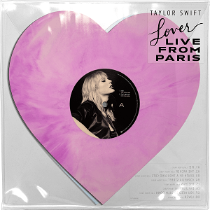

# Matching!!!

First, credits. These album covers are copyrighted... so attribution is key.

| Album Cover | Source |
|-|-|
| Red | https://en.wikipedia.org/wiki/File:Taylor_Swift_-_Red.png |
| 1989 | https://en.wikipedia.org/wiki/File:Taylor_Swift_-_1989.png|
| Reputation | https://en.wikipedia.org/wiki/File:Taylor_Swift_-_Reputation.png |
| Lover | https://en.wikipedia.org/wiki/File:Taylor_Swift_-_Lover.png |
| Folklore | https://en.wikipedia.org/wiki/File:Taylor_Swift_-_Folklore.png |
| Evermore | https://en.wikipedia.org/wiki/File:Taylor_Swift_-_Evermore.png | 
| Midnights | https://en.wikipedia.org/wiki/File:Midnights_-_Taylor_Swift.png |
| Lover (live from Paris) | https://en.wikipedia.org/wiki/File:Taylor_Swift_-_Lover_(Live_from_Paris).png | 

# Make as many matches as you can in 30 seconds!

Kudos to this [guide](https://marina-ferreira.github.io/tutorials/js/memory-game/). We wouldn't have gotten far without it.

Make matches to earn Swifties! Be sure to make as many matches as early as you can, because earlier matches will earn more Swifties. You will have 30 seconds to make as many matches as you can, and if you finish you will be awarded with a bonus Swifty. Try to shoot for the maximum of 25 Swifties!

Your 30 seconds will begin when you flip the first card. If the board size doesn't fit to your screen, try zooming in or out.

| Time Interval | Swifties Earned per Match |
|-|-|
| 0-9 seconds | 3 Swifties per match |
| 10-19 seconds | 2 Swifties per match |
| 20-29 seconds | 1 Swifty per match |

Time Elapsed: 0 seconds

Swifties Earned: 0 Swifties

<body class="MemBoard">
  <section class="board">

    

      
      
    

    

      
      
    

    

      
      
    

    

      
      
    

    

      
      
    

    

      
      
    

    

      
      
    

    

      
      
    

    

      
      
    

    

      
      
    

    

      
      
    

    

      
      
    

    

      
      
    

    

      
      
    

    

      
      
    

    

      
      
    

  </section>

  <!--  -->
  
</body>

